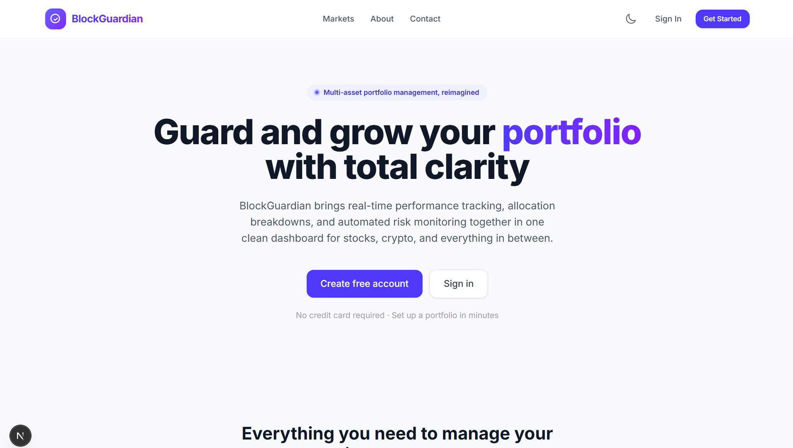

# BlockGuardian


## Portfolio and Asset Management Platform

BlockGuardian is a portfolio and asset management platform: a Flask backend for auth, portfolios, and read-only blockchain data, paired with a Next.js web dashboard and a React Native (Expo) mobile app. A user registers, authenticates with JWT (with optional MFA), and manages one or more portfolios containing stocks, bonds, cryptocurrency, ETFs, mutual funds, commodities, forex, derivatives, real estate, and other alternative assets, with computed performance, allocation, and risk views.

<div align="center">
  
</div>

## Table of Contents

- [Overview](#overview)
- [Project Structure](#project-structure)
- [Feature Status](#feature-status)
- [Technology Stack](#technology-stack)
- [Architecture](#architecture)
- [Installation and Setup](#installation-and-setup)
- [Running the Stack](#running-the-stack)
- [API Surface](#api-surface)
- [Testing](#testing)
- [CI/CD Pipeline](#cicd-pipeline)
- [Documentation](#documentation)
- [Contributing](#contributing)
- [License](#license)

## Overview

BlockGuardian demonstrates a portfolio management workflow across a real, runnable codebase. Auth, portfolios, and blockchain data are wired and covered by tests; the blockchain explorer views in both clients read genuine on-chain state (contract addresses, token supply, portfolio and trade counts) through the backend's `/api/blockchain` routes and a real web3.py service, not sample data. A handful of implemented modules, user management, compliance, and monitoring, exist but aren't yet registered as Flask blueprints, so they're not currently reachable through the running API.

## Project Structure

```
BlockGuardian/
├── code/
│   ├── backend/                # Flask REST API
│   │   ├── src/routes/         # auth, portfolio, blockchain (registered);
│   │   │                       # user (implemented, not registered)
│   │   ├── src/security/       # auth, encryption, rate limiting, audit, validation
│   │   ├── src/blockchain/     # web3.py service backing the /api/blockchain routes
│   │   ├── src/compliance/     # compliance.py, reporting.py (implemented, not registered)
│   │   ├── src/monitoring/     # metrics.py (implemented, not registered)
│   │   ├── src/models/         # SQLAlchemy models, including an AI/ML metadata schema
│   │   └── tests/               # Backend test suite
│   └── blockchain/              # Hardhat project
│       ├── contracts/          # PortfolioManager, TradingPlatform, TokenizedAsset,
│       │                       # DeFiIntegration, TestToken
│       └── test/                # Hardhat test suite
├── web-frontend/                 # Next.js web dashboard
├── mobile-frontend/                # React Native (Expo) app
├── infrastructure/                  # Docker, Kubernetes, Terraform, Ansible, disaster recovery
├── scripts/                          # Setup, build, lint, health-check, and deployment scripts
├── docs/                              # Documentation (this directory)
└── README.md
```

## Feature Status

### Application tier (wired and tested)

| Component                      | Details                                                                                                                                                                                                                                                            |
| :----------------------------- | :----------------------------------------------------------------------------------------------------------------------------------------------------------------------------------------------------------------------------------------------------------------- |
| **API**                        | Flask backend with three registered blueprints: `/api/auth`, `/api/portfolios`, and `/api/blockchain`, plus `/health` and `/api/info`.                                                                                                                             |
| **Auth**                       | JWT access and refresh tokens (Flask-JWT-Extended) with optional MFA, plus endpoints for password change and profile management. `SECRET_KEY` and `JWT_SECRET_KEY` fall back to a randomly generated value per process if unset, rather than a static placeholder. |
| **Portfolio and transactions** | Create, update, and delete portfolios; record buy, sell, deposit, withdrawal, dividend, interest, fee, transfer, split, and merger transactions; view computed performance, allocation, and risk.                                                                  |
| **Security infrastructure**    | Dedicated modules for authentication, field-level encryption, rate limiting (an in-house `RateLimiter`, not the Flask-Limiter package despite it being listed as a dependency), audit logging, and input validation.                                               |
| **On-chain data**              | The `/api/blockchain` routes (`status`, `contracts`, `explorer`) are backed by a real web3.py service and are genuinely queried by both clients' blockchain explorer views, not hardcoded sample data.                                                             |
| **Smart contracts**            | Hardhat-managed Solidity contracts: `PortfolioManager`, `TradingPlatform`, `TokenizedAsset`, `DeFiIntegration`, and a `TestToken`.                                                                                                                                 |
| **Web dashboard**              | Next.js and React app (JavaScript, Tailwind CSS, Recharts) covering Login, Dashboard, Portfolio, AI Recommendations, Market Analysis, Admin, Blockchain Explorer, and About/Contact/Terms/Privacy pages.                                                           |
| **Mobile app**                 | React Native (Expo SDK 52) app with NativeWind, covering the same core screens as the web dashboard plus a Security Check screen not present on web.                                                                                                               |

### Implemented but not exposed (no live endpoint yet)

| Component                 | Details                                                                                                                                                                                                                                                 |
| :------------------------ | :------------------------------------------------------------------------------------------------------------------------------------------------------------------------------------------------------------------------------------------------------ |
| **User management**       | `routes/user.py` is implemented but its blueprint is never registered in `main.py`.                                                                                                                                                                     |
| **Compliance**            | `compliance/compliance.py` and `compliance/reporting.py` are implemented and have their own test files, but aren't registered as blueprints either.                                                                                                     |
| **Monitoring**            | `monitoring/metrics.py` is implemented the same way: real code, no live route.                                                                                                                                                                          |
| **AI/ML metadata schema** | `models/ai_models.py` defines tables for model registration, predictions, fraud detection, risk assessment, market predictions, and anomaly detection. It's a data model only; there's no training or inference code in this repository to populate it. |

Registering the existing user, compliance, and monitoring blueprints in `register_blueprints()` is the remaining step to expose them through the API.

## Technology Stack

| Area               | Technology                                                                         |
| :----------------- | :--------------------------------------------------------------------------------- |
| Backend API        | Python 3.11, Flask, Flask-CORS, Flask-JWT-Extended, Flask-SQLAlchemy               |
| Data layer         | PostgreSQL (via SQLAlchemy), Redis                                                 |
| Blockchain client  | web3.py                                                                            |
| Blockchain         | Solidity, Hardhat                                                                  |
| Web frontend       | Next.js, React, JavaScript, Tailwind CSS, Recharts                                 |
| Mobile frontend    | React Native, Expo (SDK 52), NativeWind                                            |
| Infrastructure     | Docker, Docker Compose, Kubernetes, Terraform, Ansible                             |
| Monitoring (infra) | Prometheus, Grafana                                                                |
| CI/CD              | GitHub Actions                                                                     |
| Testing            | pytest (backend), Hardhat (contracts), Jest (web and mobile), Playwright (web e2e) |

Flask-Limiter, Flask-Caching, Flask-Migrate, Flask-SocketIO, Flask-Mail, and the Sentry SDK are all listed in `requirements.txt` but aren't imported anywhere in the backend; rate limiting, for example, is a custom in-house implementation rather than the Flask-Limiter package. Celery is also a declared dependency, and Docker Compose defines `celery_worker` and `celery_beat` containers that run `celery -A src.main:celery_app worker`, but no `celery_app` object exists anywhere in `code/backend/src`, so those two containers won't start as currently wired.

## Architecture

```
Clients
  ├── web-frontend (Next.js)              ── HTTP/JSON ──┐
  └── mobile-frontend (React Native)     ── HTTP/JSON ──┤
                                                        ▼
Backend (Flask)
  ├── Registered blueprints   /api/auth, /api/portfolios, /api/blockchain
  ├── Implemented, not registered   user, compliance, monitoring
  ├── Security     auth, encryption, rate limiting, audit, validation
  ├── Blockchain service   web3.py, backs /api/blockchain
  └── Data layer     PostgreSQL (SQLAlchemy), Redis

Blockchain (Hardhat / Solidity)
  PortfolioManager · TradingPlatform · TokenizedAsset · DeFiIntegration · TestToken
```

See [docs/ARCHITECTURE.md](docs/ARCHITECTURE.md) for detail.

## Installation and Setup

Prerequisites: Docker and Docker Compose, Node.js 18+, and Python 3.11.

```bash
git clone https://github.com/quantsingularity/BlockGuardian.git
cd BlockGuardian

# Backend
cd code/backend
python -m venv venv
source venv/bin/activate      # Windows: venv\Scripts\activate
pip install -r requirements.txt
cp .env.example .env          # edit as needed

# Web frontend
cd ../../web-frontend
npm install

# Mobile frontend
cd ../mobile-frontend
npm install
```

For an automated setup:

```bash
git clone https://github.com/quantsingularity/BlockGuardian.git
cd BlockGuardian
./scripts/setup_blockguardian_env.sh
./scripts/run_blockguardian.sh
```

Full, environment-specific instructions are in [docs/INSTALLATION.md](docs/INSTALLATION.md).

## Running the Stack

```bash
# Backend, PostgreSQL, and Redis (from code/, Docker required)
cd code
docker-compose up --build

# Or run the backend directly (from code/backend, venv active)
python -m flask --app src.main run --debug

# Web dashboard (from web-frontend)
npm run dev                        # http://localhost:3000

# Mobile app (from mobile-frontend)
npm start
```

The web and mobile frontends aren't part of `code/docker-compose.yml` and are run separately as shown above.

See [docs/USAGE.md](docs/USAGE.md) and [docs/CONFIGURATION.md](docs/CONFIGURATION.md).

## API Surface

Base URL `http://localhost:5000`.

| Group      | Prefix            | Highlights                                                                                                                                                        |
| :--------- | :---------------- | :---------------------------------------------------------------------------------------------------------------------------------------------------------------- |
| Auth       | `/api/auth`       | `register`, `login`, `logout`, `refresh`, `setup-mfa`, `enable-mfa`, `disable-mfa`, `change-password`, `profile`, `verify-token`                                  |
| Portfolios | `/api/portfolios` | list/create, `{id}`, `{id}/holdings`, `{id}/transactions`, `{id}/buy`, `{id}/sell`, `{id}/performance`, `{id}/allocation`, `{id}/risk`, `assets`, `assets/search` |
| Blockchain | `/api/blockchain` | `status`, `contracts`, `explorer`                                                                                                                                 |

Full request and response shapes are in [docs/API.md](docs/API.md).

## Testing

```bash
# Backend (from code/backend)
pytest

# Smart contracts (from code/blockchain)
npx hardhat test

# Web (from web-frontend)
npm test

# Mobile (from mobile-frontend)
npm test
```

The backend suite has four large test files: `test_auth.py` (560 lines), `test_compliance.py` (767 lines), `test_portfolio.py` (592 lines), and `test_security.py` (685 lines). `test_compliance.py` and `test_security.py` exercise the compliance and security module logic directly, independent of whether those routes are registered in the running API. The web dashboard has 4 test files (Jest) plus a Playwright end-to-end suite (`web-frontend/e2e/basic.spec.js`); the mobile app has 7 test files (Jest).

## CI/CD Pipeline

GitHub Actions (`.github/workflows/cicd.yml`) runs four jobs on push, pull request, and manual dispatch:

| Job                  | Depends on          | What it does                                                                       |
| :------------------- | :------------------ | :--------------------------------------------------------------------------------- |
| Code Quality Checks  | -                   | Python formatter checks (autoflake, black) and a repository-wide Prettier check    |
| Backend Tests        | Code Quality Checks | Runs the pytest suite with coverage and uploads the coverage report as an artifact |
| Frontend Build       | Code Quality Checks | Builds the web frontend and uploads the build artifact (no test step)              |
| Smart Contract Tests | Code Quality Checks | Compiles the contracts with Hardhat and runs the contract test suite with coverage |

There is currently no CI job for the mobile app.

## Documentation

| Document                                           | Contents                                        |
| :------------------------------------------------- | :---------------------------------------------- |
| [docs/README.md](docs/README.md)                   | Documentation index                             |
| [docs/ARCHITECTURE.md](docs/ARCHITECTURE.md)       | System architecture and design                  |
| [docs/API.md](docs/API.md)                         | API endpoint documentation                      |
| [docs/INSTALLATION.md](docs/INSTALLATION.md)       | Environment setup                               |
| [docs/CONFIGURATION.md](docs/CONFIGURATION.md)     | Configuration options and environment variables |
| [docs/USAGE.md](docs/USAGE.md)                     | End-user workflows                              |
| [docs/CLI.md](docs/CLI.md)                         | Command-line usage                              |
| [docs/FEATURE_MATRIX.md](docs/FEATURE_MATRIX.md)   | Feature coverage                                |
| [docs/TROUBLESHOOTING.md](docs/TROUBLESHOOTING.md) | Common issues and fixes                         |
| [docs/CONTRIBUTING.md](docs/CONTRIBUTING.md)       | Contribution process and standards              |
| [docs/examples/](docs/examples/)                   | Worked examples                                 |

## Contributing

See [docs/CONTRIBUTING.md](docs/CONTRIBUTING.md).

## License

This project is licensed under the MIT License - see the [LICENSE](LICENSE) file for details.
